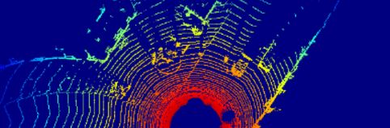
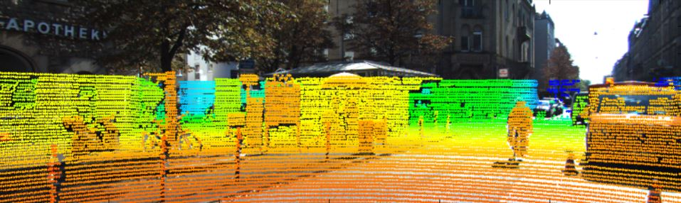
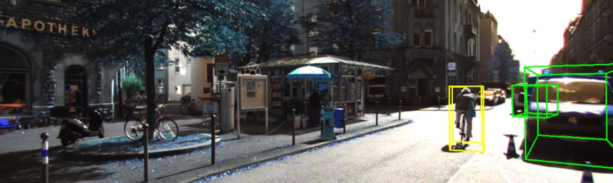

## Dataset Download 홈페이지
http://www.cvlibs.net/datasets/kitti/raw_data.php
-> raw data에서 원하는 data 다운로드

## tutorials
[`Velodyne -> Top-View Image`](Convert_Velo_2_Topview.ipynb) : Convert Velodyne data(model : HDL-64E) to Top-view image.    

     

  
  
[`Velodyne to Image Projection`](velo2cam_projection.ipynb) : Project Velodyne points(model : HDL-64E) to camera Image.  

     

  
  
[`Display 3D Tracklet`](display_groundtruth.ipynb) : Display 3D Tracklet on image  

     

  

각 ipynb파일에서 경로만 dataset과 잘 설정해서 돌려주면 됨

예시

velo_path = '/opt/ml/KITTI_Tutorial/2011_09_29/2011_09_26_drive_0013_sync/velodyne_points/data'
xml_path = '/opt/ml/KITTI_Tutorial/2011_09_29/2011_09_26_drive_0013_sync/tracklet_labels.xml'