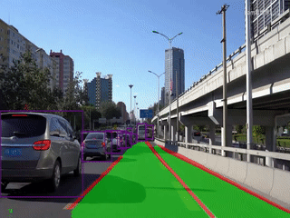

### Project Structure
```
opt/ml
|-- bdd_for_yolop
|   |-- bdd100k
|   |   |-- images
|   |   |   `-- 100k
|   |   |       |-- test
|   |   |       |-- train
|   |   |       `-- val
|   |   `-- labels
|   |       `-- 100k
|   |           |-- train
|   |           `-- val
|   |-- bdd_lane_gt
|   |   |-- train
|   |   `-- val
|   `-- bdd_seg_gt
|       |-- train
|       `-- val
`-- final-project-level3-cv-08
    `-- YOLOP
```
사용된 BDD100k의 크기는 약 8GB

### YOLOP Structure
```
YOLOP
├─inference
│ ├─images   # inference images
│ ├─output   # inference result
├─lib
│ ├─config/default   # configuration of training and validation
│ ├─core    
│ │ ├─activations.py   # activation function
│ │ ├─evaluate.py   # calculation of metric
│ │ ├─function.py   # training and validation of model
│ │ ├─general.py   #calculation of metric、nms、conversion of data-format、visualization
│ │ ├─loss.py   # loss function
│ │ ├─postprocess.py   # postprocess(refine da-seg and ll-seg, unrelated to paper)
│ ├─dataset
│ │ ├─AutoDriveDataset.py   # Superclass dataset，general function
│ │ ├─bdd.py   # Subclass dataset，specific function
│ │ ├─hust.py   # Subclass dataset(Campus scene, unrelated to paper)
│ │ ├─convect.py 
│ │ ├─DemoDataset.py   # demo dataset(image, video and stream)
│ ├─models
│ │ ├─YOLOP.py    # Setup and Configuration of model
│ │ ├─light.py    # Model lightweight（unrelated to paper, zwt)
│ │ ├─commom.py   # calculation module
│ ├─utils
│ │ ├─augmentations.py    # data augumentation
│ │ ├─autoanchor.py   # auto anchor(k-means)
│ │ ├─split_dataset.py  # (Campus scene, unrelated to paper)
│ │ ├─utils.py  # logging、device_select、time_measure、optimizer_select、model_save&initialize 、Distributed training
│ ├─run
│ │ ├─dataset/training time  # Visualization, logging and model_save
├─tools
│ │ ├─demo.py    # demo(folder、camera)
│ │ ├─test.py    
│ │ ├─train.py    
├─toolkits
│ │ ├─deploy    # Deployment of model
│ │ ├─datapre    # Generation of gt(mask) for drivable area segmentation task
├─weights    # Pretraining model
```
### For Train
* tools/train.py로 학습
* lib/config/default.py를 통해 각종 하이퍼 파라미터나 Pretrained, Freeze등을 지정해 줄 수 있다.


### For Demo
* input 이미지는 1280 x 720 크기의 이미지를 사용해야 한다. 결과값으로 다른 크기의 이미지가 필요하다면 bbox의 경우 변동되는 비율에 맞게 조정해야 되고 seg의 경우 cv.resize를 통해 크기를 조절하면 될 것 같다. 일단은 input은 1280 X 720으로 해야한다.
* demo.py는 모델에 test image를 넣어서 bbox, line seg, drivable seg를 얻고 이를 한 이미지로 합쳐서 내보내는 파일이다.
* demo.py의 138~140번째 줄에서 for문을 통해서 xyxy, conf, cls를 하나씩 이미지상에 bbox를 그리고 있는 모습을 볼 수 있고
* 그리고 143번째 줄에서는 show_seg_result()를 통해 da_seg_mask, ll_seg_mask를 받아서 이미지상에 segmentation을 그리고 작아진 이미지를 cv.resize를 통해 이미지크기를 키운다.(이 두개의 Mask들은 0과 1로 이루어져있다.)

* demo를 실행시키기 위해서는 demo.py의 171번째 줄 Source의 경로를 이미지폴더나 동영상 폴더로 주면 된다.

### Demo 영상

